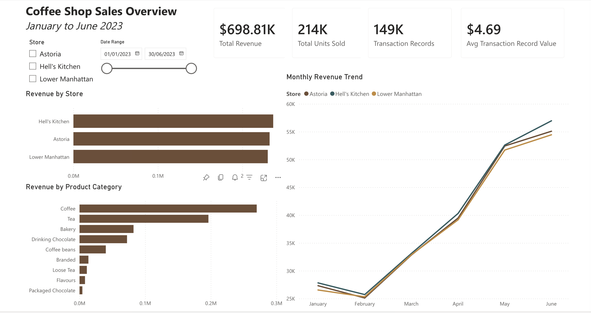
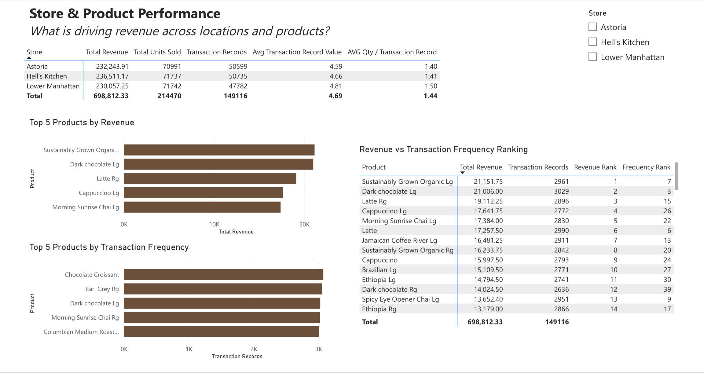
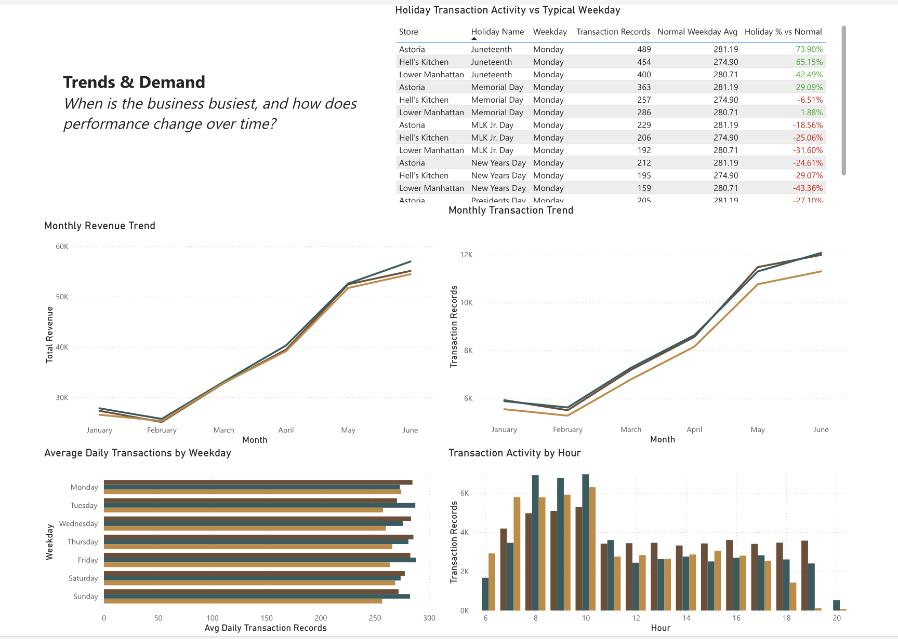

# Coffee Shop Sales Analysis

### SQL Exploratory Data Analysis & Power BI Dashboard

## Project Overview

I started this project as a one-week exercise to strengthen my SQL skills and build my first Power BI report from start to finish.

I chose a coffee shop sales dataset because I wanted to work with something that felt close to a real business problem rather than working with a fictional dataset or simply practising queries in isolation. My goal was to understand how the business was performing across its three locations, identify which products were driving revenue, explore when transaction activity was highest, and turn those findings into a dashboard that could actually be useful to someone running the business.

I deliberately started the analysis in SQL before opening Power BI. I wanted to understand the structure and limitations of the data, define the metrics properly, and answer the main business questions before deciding what deserved to become a visual.

That turned out to be one of the most useful parts of the project. Some of my original assumptions about the data were wrong, particularly around what a transaction represented. As the analysis developed, I had to change some of the questions, rethink a few metrics, and create follow-up questions based on what I was finding.

The final result is a three-page Power BI report covering overall sales performance, store and product performance, and trends in transaction demand.

## Business Problem

I approached the dataset as if I had been asked to help a coffee shop owner understand the performance of the business.

The main question I wanted to answer was:

> **How is the coffee shop performing, what is driving its revenue, and when is the business busiest?**

I broke that broad question into smaller analytical questions:

- What are total revenue, units sold and transaction records?
- How does performance differ between the three stores?
- Which products and categories generate the most revenue?
- Do the strongest products differ by location?
- How is revenue changing over time?
- What is the average monetary value and quantity represented by a transaction record?
- Are the most frequently purchased products also the products generating the most revenue?
- Which weekdays and hours experience the highest transaction activity?
- Are unusually busy or quiet days associated with holidays or other notable dates?

As I answered these questions, new questions naturally appeared.

For example, I noticed that a store could sell a high number of units without necessarily generating the highest revenue. That led me to investigate product mix, average quantity and transaction value rather than looking at revenue alone.

## Understanding the Data

Before calculating any KPIs, I spent time understanding what one row of the dataset actually represented.

This became one of the most important lessons from the project: before aggregating anything, I needed to define the **grain** of the data and ask:

> **What does one row represent, and what should one row of my result represent?**

The dataset contains individual product transaction records across three coffee shop locations.

Revenue therefore needed to be calculated at row level first:

`unit_price × transaction_qty`

and then aggregated depending on the question being answered.

For example, grouping by store gives store-level performance, while grouping by product or category answers a completely different business question.

### A Key Limitation: Transaction Records Are Not Full Customer Orders

One of my original plans was to calculate **Average Order Value (AOV)**.

However, while exploring the data I realised that `transaction_id` could not reliably be treated as a complete customer basket or order. A transaction record represents a particular product transaction, and different products purchased around the same time may appear under different transaction IDs.

Because of this, I decided not to present the metric as true AOV.

Instead, I used **Average Transaction Record Value**, calculated from the monetary value represented by each individual record.

This also affected the language I used elsewhere in the analysis. For example, I refer to **transaction activity** rather than claiming that transaction counts represent unique customers.

I found this useful because it reinforced that a metric should be defined by what the data can actually support, rather than by what I originally hoped to calculate.

### Other Limitations

There were a few other limitations I kept in mind throughout the project:

- The dataset does not contain a customer identifier, so I could not perform customer-level analysis such as repeat customers or customer lifetime value.
- Transaction activity can be used as a proxy for demand, but not as an exact count of unique customers.
- The dataset covers only January to June 2023, so the trend analysis represents six months rather than a complete annual cycle.
- Each holiday appears only once in the available period. I could compare holiday activity with a typical weekday, but I could not confidently claim that the holiday itself caused the difference.

## SQL Exploratory Analysis

Once I understood the structure of the dataset, I used SQL to work through the business questions before building anything in Power BI.

I did this deliberately. I wanted to understand the numbers first, validate the calculations, and identify which findings were actually worth visualising rather than using Power BI as a place to explore blindly.

The SQL analysis started with simple aggregations and gradually became more complex as new questions came from the results.

### Starting With the Core KPIs

I began with the basic measures that describe the scale of the business:

- Total Revenue
- Units Sold
- Transaction Records
- Performance by Store

Revenue was calculated as:

`unit_price × transaction_qty`

at row level before being summed.

This seems simple now, but it became an important rule for the rest of the project:

> **Calculate the metric at the correct grain first, then aggregate it.**

From there, I broke revenue down by product, category and store to understand what was actually driving overall performance.

### Comparing Products Within Each Store

One of the first SQL problems that pushed me beyond basic `GROUP BY` queries was finding the Top 5 revenue-driving products for each store.

My first instinct was to think about `LIMIT`, but that would only return the Top 5 products across the entire result.

What I actually needed was:

> **aggregate → rank within each store → filter the ranking**

This introduced me to window functions such as `RANK()` and the importance of `PARTITION BY`.

Using:

`PARTITION BY store_location`

allowed each location to have its own independent product ranking.

This pattern is something I want to remember because it applies to many other Top-N-per-group problems.

### Learning to Compare Periods With `LAG()`

For the month-to-month analysis, I wanted more than monthly revenue totals.

I wanted to understand whether revenue was growing or declining and by how much.

This was where I first used `LAG()`.

Months have a natural sequence, so `LAG()` allowed me to bring the previous month's revenue beside the current month's revenue for each store.

From there I calculated:

- Absolute change
- Percentage change from the previous month

One useful lesson here was understanding the denominator in the percentage calculation:

`(current - previous) / previous`

The previous period is the baseline I am measuring the change against.

Using `PARTITION BY store_location` also meant that each store was only compared with its own previous month rather than with another location.

### When One Query Was No Longer Enough

The weekday analysis was where I started to properly understand why more complex analysis often needs multiple query layers.

At first, I wanted to find the busiest weekdays.

Simply counting all Monday transactions and comparing them with all Tuesday transactions would not necessarily be fair, because the dataset may contain a different number of each weekday.

Instead, I calculated:

1. Transaction records for each individual date and store
2. The normal daily level for each store
3. Average daily transaction activity for each weekday
4. The difference between each weekday and the store's normal day

This required CTEs because the calculations existed at different levels of detail.

That helped make another SQL concept much clearer to me:

> **`GROUP BY` changes the grain of the result, while a window function can add information without collapsing the existing rows.**

Once I started thinking about the grain at each stage, the query became much easier to reason about.

### The Holiday Analysis: The Query I Struggled With Most

The holiday analysis grew out of the weekday analysis after I noticed large differences between some daily minimum and maximum transaction values.

Initially, I was comparing holiday activity with the store's overall daily average.

After working through the logic, I realised that wasn't the fairest comparison.

A holiday that falls on a Monday should be compared with:

> **normal non-holiday Mondays at the same store**

rather than with an average made from every weekday.

To do this, I:

1. Created daily transaction totals
2. Classified relevant holiday dates
3. Calculated a non-holiday weekday baseline for each store
4. Preserved each individual holiday date
5. Compared the holiday's transaction activity with its matching weekday baseline

This was probably the part of the SQL analysis I found most difficult, but it was also one of the most useful.

The main lesson was that when the metric I am analysing and the baseline I need exist at different grains, I should not try to force everything into one `GROUP BY`.

Sometimes another CTE or query layer is exactly what is needed.

### Keeping My Mistakes in the Project

I decided to keep some of my earlier SQL attempts in the commented EDA file rather than deleting everything that was wrong.

For example, at one point I tried to calculate product revenue using transaction frequency multiplied by unit price.

I later realised that this ignored `transaction_qty` and could also make unsafe assumptions about price.

The correct approach was to return to the row-level revenue calculation:

`SUM(unit_price * transaction_qty)`

I kept the earlier version in the file because I wanted the SQL document to show not only the final answer, but also what I misunderstood and why I changed it.

For me, that makes the file more useful as a learning reference than a perfectly cleaned script that hides the process.

## Building the Power BI Report

After completing the main exploratory analysis in SQL, I moved into Power BI.

This was my first time building a complete Power BI report from a raw dataset, so I deliberately treated this part of the project as another learning process rather than simply recreating my SQL outputs as charts.

I imported the transaction-level dataset rather than importing aggregated SQL results.

This allowed the report to remain interactive: measures could recalculate when a user selected a store, changed the date range or interacted with another visual.

The SQL analysis still played an important role.

By the time I opened Power BI, I already understood the main metrics, the grain of the dataset, the limitations I needed to respect and the business questions I wanted the report to answer.

One of the biggest decisions I made was not to turn every SQL result into a visual.

The EDA was there to investigate the data; the dashboard needed to tell a clearer and more focused business story.

### Learning Measures, Calculated Columns and Filter Context

One of the biggest adjustments for me was moving from SQL thinking into DAX.

In SQL, I was used to explicitly grouping rows and returning a fixed result.

In Power BI, I had to understand that a measure is calculated dynamically depending on the current filter context.

I created measures for the core KPIs, including:

- Total Revenue
- Total Units Sold
- Transaction Records
- Average Transaction Record Value
- Average Quantity per Transaction Record
- Average Daily Transaction Records

At first, concepts such as measures, calculated columns and filter context felt quite different from SQL.

As the report developed, I started to understand the distinction more clearly:

- **Calculated columns** create row-level values that are stored in the model.
- **Measures** calculate results dynamically depending on the current report filters.
- **Filter context** determines which part of the data a measure is currently evaluating.

This became especially important once I started adding slicers and creating comparisons that needed to change dynamically by store.

### Moving Beyond Basic DAX

The first measures were relatively straightforward, but the report became more challenging once I started recreating some of the more advanced SQL analysis.

For the product analysis, I wanted users to be able to select a store and have product rankings recalculate automatically.

This introduced me to `RANKX()` and `ALLSELECTED()`.

One mistake I made initially was trying to rank products while the current product row was still restricting the calculation.

This caused every product to appear as rank 1.

Working through that problem helped me understand that the measure needed to compare the current product against the wider set of products while still respecting report selections such as the Store slicer.

Later, I used `ISINSCOPE()` to prevent rank values from appearing in the total row of the product table, because a total-level product rank did not have a meaningful business interpretation.

This was one of the parts of the project where DAX started to make more sense to me.

Instead of thinking only about the formula, I had to think about:

> **What filters are active when the formula is being evaluated?**

### Understanding `CALCULATE()`

The holiday analysis was where filter context became much clearer.

I wanted each holiday to be compared with the normal non-holiday value for the same weekday and store.

To do that, I had to calculate a baseline that:

- kept the current store
- kept the current weekday
- ignored the specific holiday date
- excluded other holiday dates

This was where I started to understand what `CALCULATE()` is really doing.

Rather than thinking of it as just another DAX function, I began thinking of it as:

> **Calculate this measure again, but under a different set of filters.**

That mental model made the holiday comparison much easier to understand and gave me a much better foundation for working with DAX in future projects.

### Designing the Report as a Story

Once the measures were working, I organised the report into three pages.

I wanted each page to answer a different level of the business question rather than placing every visual on one dashboard.

### 1. Coffee Shop Sales Overview

The first page gives the high-level picture of the business.

It includes:

- Total Revenue
- Total Units Sold
- Transaction Records
- Average Transaction Record Value
- Revenue by Store
- Revenue by Product Category
- Monthly Revenue Trend
- Store and Date slicers

I designed this page so someone could understand the overall scale and direction of the business before looking at the detail.

### 2. Store & Product Performance

The second page moves deeper into what is driving the results.

It compares the three stores across revenue, units, transaction records, average quantity and transaction-record value.

I also created separate Top 5 views for:

- Products by revenue
- Products by transaction frequency

One of the reasons I wanted both was because I learned during the SQL analysis that **popular and high-revenue are not necessarily the same thing**.

The product ranking table makes that difference more visible by placing Revenue Rank and Frequency Rank beside each other.

### 3. Trends & Demand

The final page focuses on when transaction activity happens.

It includes:

- Monthly Revenue Trend
- Monthly Transaction Trend
- Average Daily Transactions by Weekday
- Transaction Activity by Hour
- Holiday Transaction Activity vs Typical Weekday

This page developed directly from questions that came up during the EDA.

For example, the holiday analysis was not part of my original dashboard plan.

It came from noticing unusually high and low daily transaction values during the weekday analysis and asking what might explain them.

That became an important lesson for me:

> **Exploratory analysis does not always follow a perfectly straight path. Sometimes the most useful question comes from something unexpected in an earlier result.**

### From a Report to a Published Dashboard

After completing the three pages, I carried out a final QA pass across the report.

I checked:

- KPI values against the SQL analysis
- Slicer behaviour
- Dynamic product rankings
- Weekday ordering
- Percentage formatting
- Total rows
- Chart and measure naming
- Consistency of colours and layout across pages

I then published the finished report to Power BI Service and tested the interactive version in the browser.

Reaching that point was important to me because the project had gone through the full process:

> **raw data → SQL exploration → metric validation → DAX/model development → report design → QA → published report**

## Key Findings & Insights

Once the SQL analysis and Power BI report were complete, several patterns stood out.

### Overall Performance

Across January to June 2023, the three coffee shop locations generated approximately:

- **$698.8K in revenue**
- **214.5K units sold**
- **149.1K transaction records**
- **$4.69 average transaction record value**

The business also showed a generally positive revenue trend over the six-month period.

All three stores experienced a decline in February, followed by a strong recovery from March onwards.

Growth was particularly strong through March, April and May, before slowing in June.

When I compared the monthly revenue and transaction-record trends in Power BI, the two patterns moved very closely together.

This suggests that much of the revenue growth during the period was associated with increased transaction activity rather than a dramatic change in average transaction-record value.

I would treat this as an indication rather than a causal conclusion, but it gives the business a useful direction for further investigation.

### The Three Stores Perform Differently

One of the most interesting findings was that the store with the most revenue was not the store selling the most units.

**Hell's Kitchen** generated the highest total revenue at approximately **$236.5K** and also recorded the highest number of transaction records.

However, **Lower Manhattan** sold the most units despite having the fewest transaction records and the lowest total revenue of the three stores.

That initially looked contradictory, so I investigated average quantity and transaction-record value.

Lower Manhattan had:

- the highest average quantity per transaction record
- the highest average transaction record value
- but fewer transaction records overall

This helped explain how Lower Manhattan could sell slightly more units while still generating less total revenue.

It also reinforced something I learned throughout the project:

> **Looking at one KPI in isolation can hide an important part of the story.**

### Popular Products Are Not Always the Biggest Revenue Drivers

Another pattern I wanted to investigate was the difference between product popularity and product revenue.

I created separate rankings for:

- Revenue
- Transaction frequency

The results showed that the two rankings were not always the same.

Some products generated a high level of revenue without appearing as frequently in transaction records, while other products were purchased very frequently without ranking as highly for revenue.

This matters because simply identifying the "most popular" product does not necessarily identify the product that contributes the most money to the business.

From a business perspective, I would therefore look at both measures when evaluating product performance rather than relying on sales frequency alone.

### Morning Hours Are the Strongest Period for Transaction Activity

The hourly analysis showed a clear concentration of transaction activity during the morning.

The strongest activity generally occurred around **8 AM to 10 AM**, after which transaction levels became lower and more stable throughout the rest of the day.

This is one of the findings that could translate quite directly into an operational decision.

If the pattern is consistent over time, the business may want to ensure that staffing, product preparation and stock availability are strongest during the morning peak.

One limitation I would keep in mind is that transaction activity can also be influenced by store opening hours, so I would want additional operational data before describing this purely as customer demand.

### Weekday Differences Were Smaller Than I Initially Expected

I expected the weekday analysis to reveal one or two days that were dramatically busier than the others.

Instead, the average daily transaction levels were relatively close across much of the week.

This was useful because it reminded me not to force a dramatic conclusion where the data does not show one.

The more meaningful variation appeared when I looked at specific dates and holidays rather than simply Monday versus Tuesday versus Wednesday.

### Holiday Activity Was Highly Variable

The holiday analysis produced some of the largest deviations from normal weekday activity.

Because every holiday in the dataset occurred on a Monday, I compared each holiday with the typical non-holiday Monday for the same store.

The strongest result was **Juneteenth**, which recorded substantially higher transaction activity than a typical Monday across all three locations.

Memorial Day produced a more mixed result, while New Year's Day, MLK Jr. Day and Presidents Day were generally below the normal Monday baseline.

This suggests that holidays should not automatically be treated as either "busy" or "quiet" days.

Different holidays can behave very differently.

However, the dataset contains only one observation of each holiday, so I would not use these results alone to forecast future holiday performance.

More years of data would be needed before making a stronger conclusion.

### What Stood Out to Me

The biggest takeaway from the analysis was that the most useful findings often appeared when two metrics seemed to disagree.

Lower Manhattan selling the most units without generating the most revenue led me deeper into quantity and transaction value.

Differences between product frequency and revenue led me to build separate rankings.

Unexpected daily highs and lows led to the holiday analysis.

Instead of treating those differences as problems with the results, I learned to use them as starting points for the next question.

## Business Recommendations

The purpose of the analysis was not only to describe what happened, but to think about how the findings could support business decisions.

Because the dataset covers only six months, I would treat these recommendations as areas to test and monitor rather than definitive long-term conclusions.

### Prepare More Heavily for the Morning Peak

Transaction activity is strongest during the morning, particularly around **8 AM to 10 AM**.

If this pattern continues, I would prioritise staffing, preparation and product availability during this period.

For example, the business could make sure high-demand drinks and food products are fully prepared before the morning rush and schedule enough staff to avoid slower service during the busiest hours.

I would also compare this pattern with staffing and waiting-time data if those became available.

That would help determine whether the current staffing level is actually meeting demand efficiently.

### Evaluate Products Using Both Revenue and Frequency

The product analysis showed that the most frequently purchased products are not always the products generating the most revenue.

Because of this, I would avoid judging product performance using a single ranking.

A high-frequency product may be important because it is purchased regularly, while a lower-frequency product may still make a strong financial contribution because of its price or quantity sold.

I would monitor both **transaction frequency and revenue contribution** when making decisions about product availability, promotions or menu changes.

Products that rank strongly on both measures would be particularly important to keep consistently available.

### Investigate Lower Manhattan's Different Transaction Pattern

Lower Manhattan recorded the highest number of units sold despite having fewer transaction records than the other locations.

It also had the highest average quantity per transaction record and the highest average transaction record value.

I would investigate what is driving that pattern.

Possible areas to examine would include product mix, product sizes, pricing and whether particular products are being purchased in larger quantities at this location.

I would not assume from the current analysis that one of these factors is responsible, but the difference is strong enough to justify a deeper investigation.

### Plan Around Location-Specific Behaviour

Although the three stores follow broadly similar overall trends, they do not perform identically.

Hell's Kitchen generated the highest revenue, while Lower Manhattan displayed a different relationship between transaction activity and units sold.

This suggests that operational or product decisions should not automatically be applied in exactly the same way across every location.

Where possible, I would continue analysing stores separately before making decisions about stock levels, product focus or staffing.

### Treat Holiday Demand Individually

The holiday analysis showed that different holidays can behave very differently.

Juneteenth was substantially busier than a typical Monday across all three locations, while several other holidays were below normal Monday activity.

I therefore would not use a simple assumption such as "holidays are busier" when planning staffing or inventory.

Instead, I would track each holiday separately over multiple years and build a historical baseline before using the results for forecasting.

The current dataset contains only one observation of each holiday, so these results are useful signals rather than enough evidence for a long-term forecasting rule.

### Continue Monitoring the Growth Trend

Revenue fell in February before recovering strongly through March, April and May, with growth slowing in June.

The monthly transaction trend followed a very similar pattern.

I would continue monitoring both revenue and transaction activity to understand whether this growth continues beyond June.

If revenue continues to rise alongside transaction activity, the business could then investigate whether the growth is coming mainly from more transactions, higher quantities, changes in product mix or changes in transaction value.

That would be the next stage of the analysis rather than assuming the six-month pattern will automatically continue.

## What I Learned & Challenges

This project taught me much more than how to write a few SQL queries or build a Power BI dashboard.

The biggest lesson was:

> **Getting a query to run is not the same as getting the analysis right.**

### Defining the Grain Before Calculating Anything

One of the most important habits I developed was asking:

> **What does one row represent?**

I realised that if I misunderstood the grain, every calculation built on top of it could become misleading.

This became especially important when I originally planned to calculate Average Order Value.

After checking the dataset more carefully, I realised that `transaction_id` could not safely be treated as a complete customer basket.

Instead of forcing the metric, I changed it to **Average Transaction Record Value**.

That was probably one of the strongest analytical lessons from the project:

> **If the data cannot support a metric properly, change the metric rather than pretending the limitation does not exist.**

### Learning to Think in Layers

At the beginning of the project, I was more comfortable with straightforward `SELECT`, `GROUP BY` and aggregation queries.

As the questions became more complex, I had to learn how to break a problem into stages.

The weekday and holiday analyses were especially useful for this.

Instead of trying to calculate everything at once, I started thinking in layers:

- Create the correct daily grain
- Calculate the baseline
- Preserve the information needed for comparison
- Aggregate again at the final reporting level

This helped me understand why CTEs and window functions are so useful.

I also learned the difference between using `GROUP BY` to collapse rows and using window functions to add context without losing the existing grain.

### Window Functions Finally Started to Make Sense

Before this project, functions such as `RANK()` and `LAG()` felt more abstract to me.

Using them on real business questions made them much easier to understand.

`RANK()` became useful when I needed the Top 5 products inside each store rather than the Top 5 products overall.

`LAG()` became useful when I needed to compare each month's revenue with the previous month.

The biggest thing I learned was that `PARTITION BY` defines where the calculation restarts.

Once I understood that concept, window functions stopped feeling like isolated SQL syntax and started feeling like tools for answering specific analytical questions.

### Moving From SQL Into DAX Was a Different Way of Thinking

Power BI introduced another challenge.

In SQL, I was used to explicitly deciding how data should be grouped and then returning a result.

In Power BI, measures needed to work dynamically depending on the current filter context.

I initially found this difficult, especially when building product rankings and the holiday baseline.

Working through `RANKX()`, `ALLSELECTED()`, `CALCULATE()` and `ISINSCOPE()` helped me understand that the question is not only:

> "What formula am I writing?"

but also:

> **"What filters are active while this formula is being evaluated?"**

That shift in thinking was one of the biggest things I learned from building the report.

### Mistakes Became Part of the Learning

I made several mistakes during the project.

One example was an early revenue calculation where I multiplied transaction frequency by unit price.

After reviewing the logic, I realised that this ignored `transaction_qty` and could also make incorrect assumptions about price.

Rather than deleting the mistake completely, I kept the earlier version in my commented EDA file and documented why it was wrong.

I did this because I wanted the SQL file to become something I could return to later, not just a polished final answer with all the learning removed.

### Not Every Interesting Result Belongs on the Dashboard

Another lesson was learning when to stop analysing.

The SQL EDA produced more information than I eventually used in Power BI.

At first, it was tempting to turn every result into another visual.

As the report developed, I started thinking more about what each page was actually trying to communicate.

That helped me separate exploratory analysis from dashboard design.

> **The role of the EDA was to investigate.**

> **The role of the report was to communicate the strongest findings clearly.**

### What I Would Take Into My Next Project

If I started another analytics project tomorrow, I would approach it differently from how I started this one.

I would:

- Define the grain immediately
- Write down the business questions before building visuals
- Validate important metrics before using them in a dashboard
- Distinguish between what the data shows and what I am only inferring
- Use unexpected results to generate follow-up questions
- Keep the dashboard focused instead of trying to visualise every piece of analysis
- Document mistakes and decisions while I work rather than trying to reconstruct them afterwards

This project gave me a much better understanding of the full analytical process, from questioning the data to communicating a final result.

## Tools Used

- **SQL / MySQL** — exploratory analysis, aggregation, window functions, CTEs and validation
- **Power BI** — data modelling, DAX measures, interactive reporting and dashboard design
- **Power Query** — data inspection and preparation
- **DAX** — dynamic measures, rankings, filter-context calculations and comparisons
- **GitHub** — project documentation and portfolio presentation

## Repository Contents

This repository contains the main files used throughout the project:

- `EDA_commented.sql`  
  My commented SQL exploratory analysis, including the business questions, calculations, mistakes I corrected and notes explaining what I learned.

- Raw coffee shop sales `.csv` file  
  The transaction-level dataset used for both the SQL analysis and Power BI report.

- `screenshots/`  
  Screenshots of the three completed Power BI report pages:
  - Coffee Shop Sales Overview
  - Store & Product Performance
  - Trends & Demand

The Power BI report was built from the transaction-level data so that measures and visuals could respond dynamically to filters and slicers.

## Dataset

The project uses the **Coffee Shop Sales and Revenue Data** dataset available on Kaggle.

The data covers coffee shop transactions from **January to June 2023** across three New York locations:

- Astoria
- Hell's Kitchen
- Lower Manhattan

Dataset source:  
[Kaggle - Coffee Shop Sales and Revenue Data](https://www.kaggle.com/datasets/agungpambudi/trends-product-coffee-shop-sales-revenue-dataset)

## Final Reflection

I started this project wanting to practise SQL and learn how to build a Power BI dashboard.

By the end, the biggest improvement was not really a particular SQL function or DAX formula.

It was learning to think more carefully about the questions behind the calculations.

I had to challenge some of my original assumptions, change metrics when the data could not support them, work through problems at different levels of detail and decide which findings were important enough to include in the final report.

The finished dashboard is the visible result of the project, but the part I value most is the process behind it.

For future projects, I want to continue improving both sides of analytics: the technical ability to investigate data and the judgement needed to turn that analysis into a clear business story.
